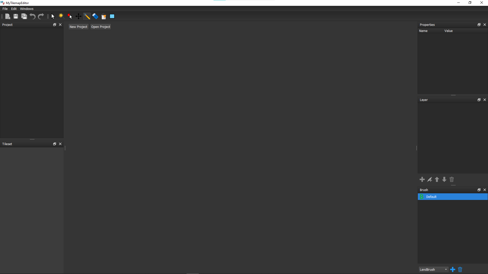
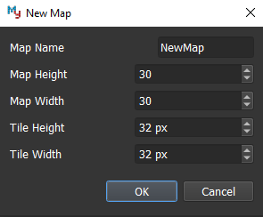
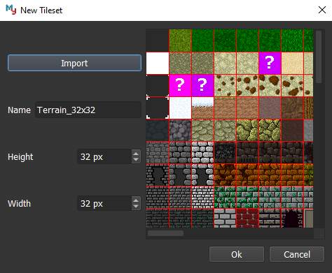
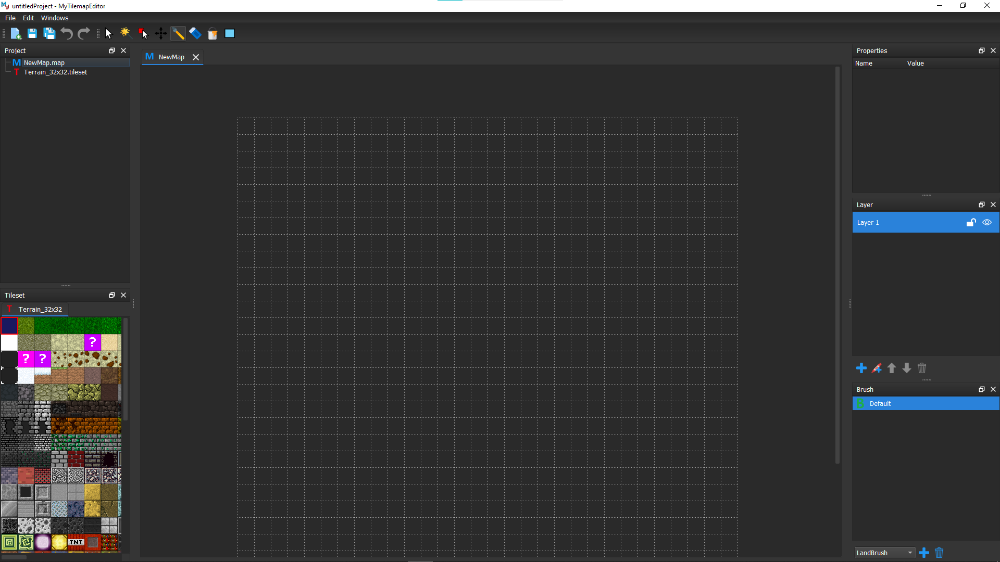

Introduction
============

About MyTilemapEditor
---------------------

MyTilemapEditor is a 2D tile map editor with a scriptable brush. 
MyTilemapEditor can create a map in any size. It can also import 
sprite sheet and slice the sprite sheet into sprites that can use 
to paint on the map. MyTilemapEditor supports different proportion 
of sprite and the map has multiple layers. User can also use 
Javascript to program brush logic, and editor will create brush 
instance file base on Javascript file.

MyTilemapEditor can export a PNG image or an XML file. There is a 
plugin for Unity that can import the map from MyTilemapEditor to Unity. 
Besides, it can also generate Tile Palette as well in case the user can 
keep editing it.

.. figure:: ../images/introduction/preview.png
   :alt: MyTilemapEditor Preview

Getting Started
---------------

New Project
~~~~~~~~~~~

When opening up MyTilemapEditor for the first time, the first thing you need to do is create a project.

   

New Map
~~~~~~~~~~~

To create a new map, choose File -> New -> Map. The following dialog will pop up:

   
Here, we choose the initial map name, map size and tile size.

New Tileset
~~~~~~~~~~~

After creating our map, we will see the tile grid and an initial tile layer will be added to the map. 
However, before we can start using any tiles, we need to add a tileset. Choose File -> New -> Tileset to open the New Tileset dialog:

   
Click the :guilabel:`Import` button and select a image. 
This example tileset uses a tile size of 32x32.
You can see the preview in the right side.

When we have the map and the tileset, MyTilemapEditor should look as follows and ready to go:

