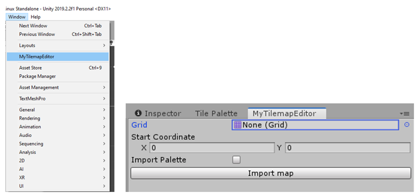
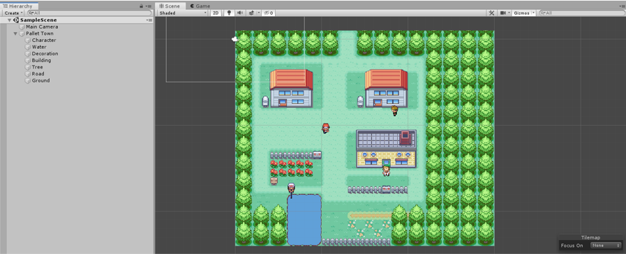
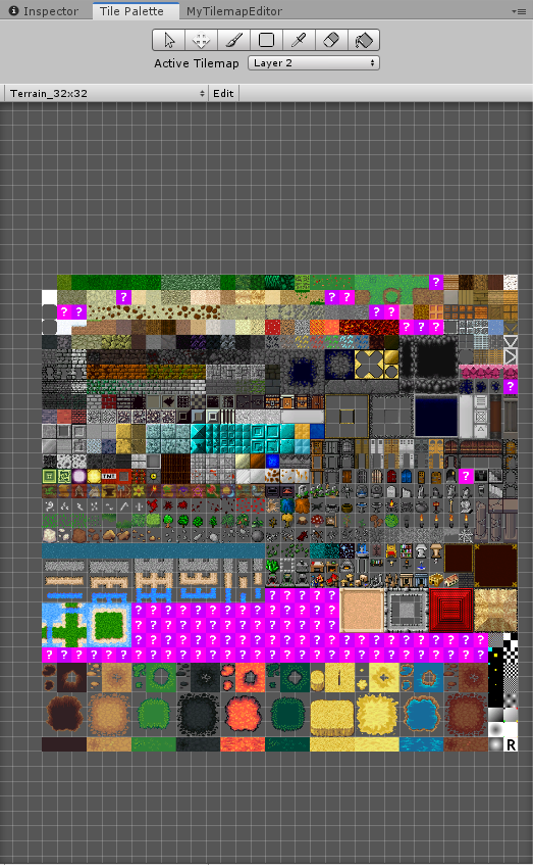

Output
=============

Image
---------------------

Maps can be exported as image. MyTilemapEditor supports the PNG format [8]. User can export current map as 
image by choose File -> Export -> PNG.

XML
---------------------

The XML format is the most common additional file format supported by MyTilemapEditor. All the files are 
saved and read as XML files by the third-party tool TinyXML2. 

Unity
---------------------

Unity, as people know, is a powerful game engine, but it also provides functions for the user to create a 
tool kit. Once the XML file is generated by MyTilemapEditor and imported the MyTilemapEditor package into 
Unity, then go to Unity and open the MyTilemapEditor window. Press the “Import map” button to generate a 
tilemap in Unity. If the user assigns a Grid, then it will try to update the current tilemap under the Grid

   

   
In Unity, it has a Tile Palette component. Tile Palette allows the user to paint the tiles on Tilemap 
component. It is a case that the user may want to keep editing the map. Therefore, by checking the Import 
Palette check box, it will generate Unity Tile Palette component files, but it takes more time to load. 
Loading time based on how many tiles require to be sliced on the image. For example, if an image requires 
to be sliced into 32 by 32 tiles, it will generate 1024 tile assets on the project folder. 

