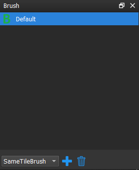
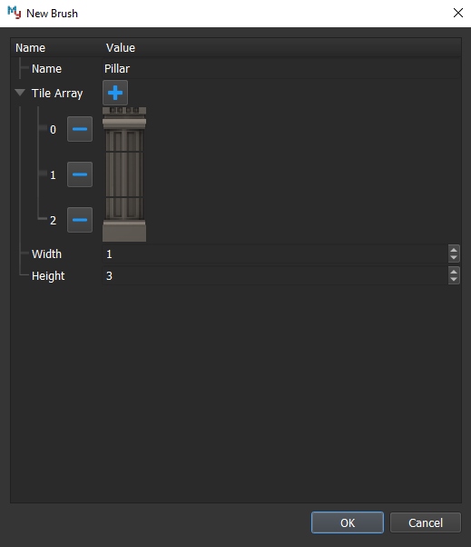
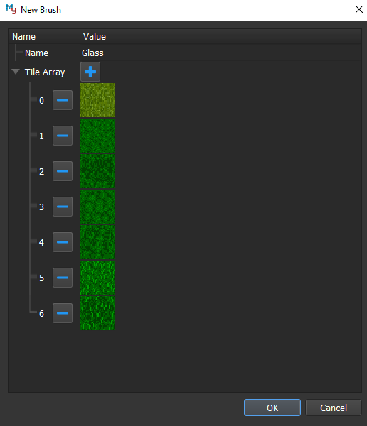
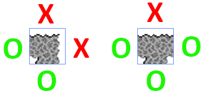
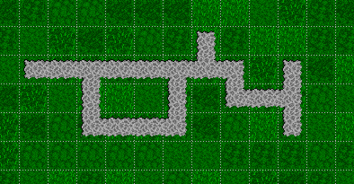
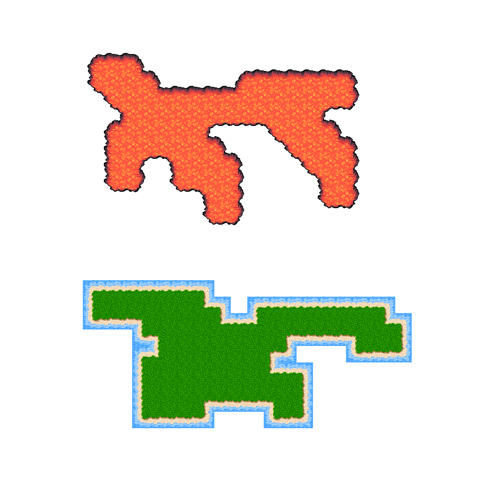
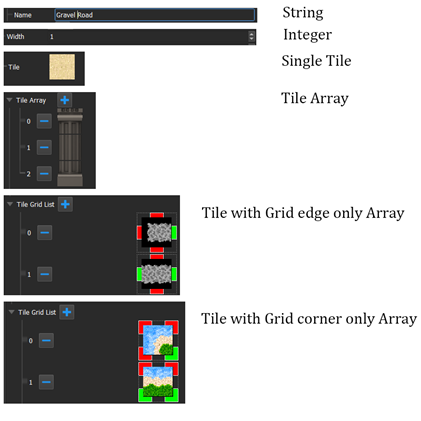

Scriptable Brush
================

The implementation of the scriptable brush system which is based on the brush JavaScript files. 
A brush JavaScript file contains variables, painting logic, erasing logic and setup functions.

-  All brush files are loaded while editor is opening.
-  A brush file can create a brush instance by selecting the brush type in the drop-down list and clicking new brush 
   button on the brush window and assign variable through the editor. After a new brush instance is created, an XML 
   file will be generated for saving the assigned variable's value.
-  All of the brush instances will contain a name variable. This variable is for the XML file name and displaying name in the brush window.

Default Types
-------------

Same Tile Brush
~~~~~~~~~~~~~~~

Same tile brush includes one variable which saves a tile. It can paint the specific tile into the map.

Large Item Brush
~~~~~~~~~~~~~~~~

Large item brush includes an array of tiles, a width value, and a height value. It can paint all the tiles in the array 
base on the width and height from left to right, top to bottom.

Random Brush
~~~~~~~~~~~~

Random brush includes an array of tiles. When the paint function is called, it will pick a random tile in the array 
and paint the tile into the map.

Road Brush
~~~~~~~~~~

Road brush includes an array of tiles with grids. The feature of this brush is to paint a continuing road. 
Based on the top, right, bottom, and left side of the tile, it will try to paint the best tile, 
in the array of tiles, in the giving coordinate. In order to paint a road, the user has to define 
the road information, helping editor to determine that every edge of tile should connect the way or not.

For example, if the user tries to paint in the (1, 1) coordinate, the editor will check the tile on 
the top coordinate that is this tile in the array of defined tile. If so, get the value of the bottom 
edge in the top coordinate, and do the similar steps with the left, bottom, and right sides’ coordinate. 
As the result, the editor can pick a tile that fits within the (1, 1) coordinate, but if there is no best 
solution, it will stay empty tile.
   

   
Land Brush
~~~~~~~~~~

Land brush includes an array of tiles with grids. The feature of this brush is to paint a 9-slicing terrain 
into the map. Land brush is similar to the road brush, but instead of defining the edges of the tile, the user 
should define the corner of the tile.
   

Custom Type
-----------

In the application path, Brushes folder includes all the scriptable brushes. You can add you own brush file following 
the format below.

Basic Functions
~~~~~~~~~~~~~~~

The brush files contain 4 basic functions which be called in different situations.

Startup() : void
    This function will be called when current brush file is loaded. In most cases, you should expose variables in here.
	
Update() : void
    This function will be called after user creates a new brush file and assigns values into expose variables.
	
Draw(coordX : int, coordY : int) : void
    This function will be called when user wants to paint tile into map. Input is the coordinate of the user clicked location.
	
Erase(coordX : int, coordY : int) : void
    This function will be called when user wants to erase tiles in the map. Input is the coordinate of the user clicked location.

Support Functions
~~~~~~~~~~~~~~~~~

Based on the basic functions, there are several support functions for the user to program the scriptable brush.
 
ExposeVariable(variableName : string, labelName : string, variableType : enum) : void
    This function is for generate UI and assign value to specific variable. This is most important function, because it communicates with editor and provides variable name as well as variable type.
	
helper.setTile(coordX : int, coordY : int, tile : Asset) : void
    This function is for painting tile into current map, but it will not update immediately. All the changes will be updated after Draw or Erase functions.

helper.eraseTile(coordX : int, coordY : int) : void
    This function is for erasing tile in the map.

helper.isSameTile(coordX : int, coordY : int, tile : Asset) : bool
    This function is for compare between tile in the coordinate and tile in the parameter are the same tile.

helper.isConatainTile(coordX : int, coordY : int, tiles : AssetArray) : bool
    This function is for checking the tiles contain the tile in the coordinate.

helper.getRandomInRange(lowNumber : int, highNumber : int) : int
    Get random integer number within range.

Support Variable Types
~~~~~~~~~~~~~~~~~~~~~~

For every exposed variable, editor will generate UI base on the variable type. In the MyTilemapEditor, it equips the following variable types.

String
    A single input box which allows user typing text.
	
Integer
    A single input box with up and down arrow buttons which allows user typing numeric text. The range of number is from -2147483648 to 2147483647.
	
Single Tile
    A tile selector is a button. When the user clicking on the rectangle button, it will pop up a dialog that allows the user to choose a tile from the tilesets, and the selected tile will be represented on the button. If there is no selected tile, the magenta color will be used for the button.
	
Tile Array
    This type of variable contains an array of tiles. The user can add a tile by clicking the plus button and delete a tile by clicking the minus button. On the tile selecting dialog, it allows selecting more than one tile.

Tile with Grid edge only Array
    Tile with Grid is a type that has a tile button surround with 3 by 3 buttons. The buttons represent the Boolean type. In this case, green is true, and red is false. The user can click on the buttons to switch between green color and red color.

Tile with Grid corner only Array
    This also a Tile with Grid type, but it only allows the user to modify the corner of buttons and tile itself.

